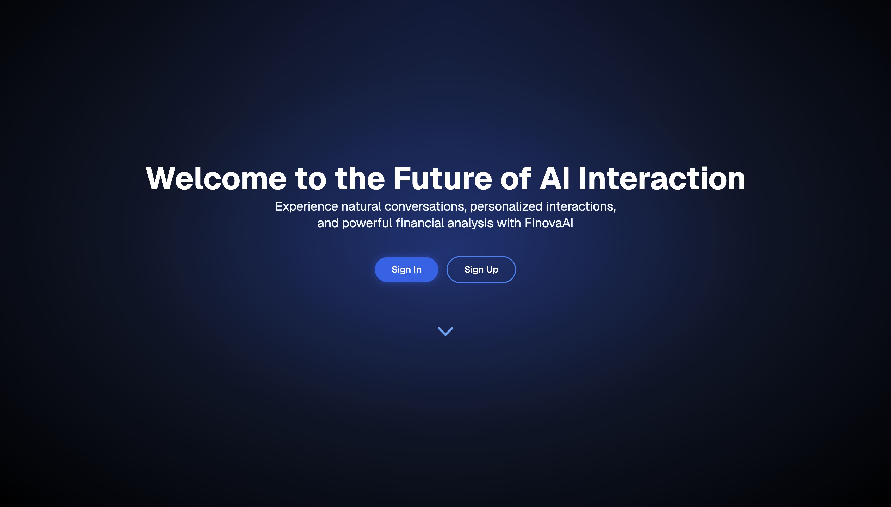
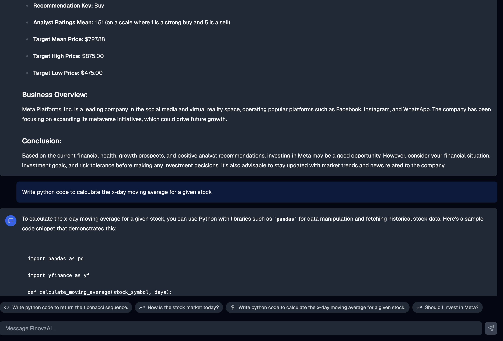

<h1 align="center">FinovaAI - Your Intelligent Financial Companion</h1>

 At the intersection of finance and innovation, FinovaAI combines cutting-edge technology with financial expertise to provide personalized financial insights and assistance.

  

 

## Features

- Natural Language Processing for intuitive financial conversations
- Personalized interactions that remember your preferences
- Advanced financial analysis and portfolio management
- Built with Next.js and Supabase for a robust, scalable platform
- Modern UI with Tailwind CSS and shadcn/ui
- Secure authentication and data storage
- Works across the entire [Next.js](https://nextjs.org) stack
  - App Router
  - Pages Router
  - Middleware
  - Client
  - Server

## Demo

You can view a fully working demo at [tej-ai.vercel.app](https://tej-ai.vercel.app/).
